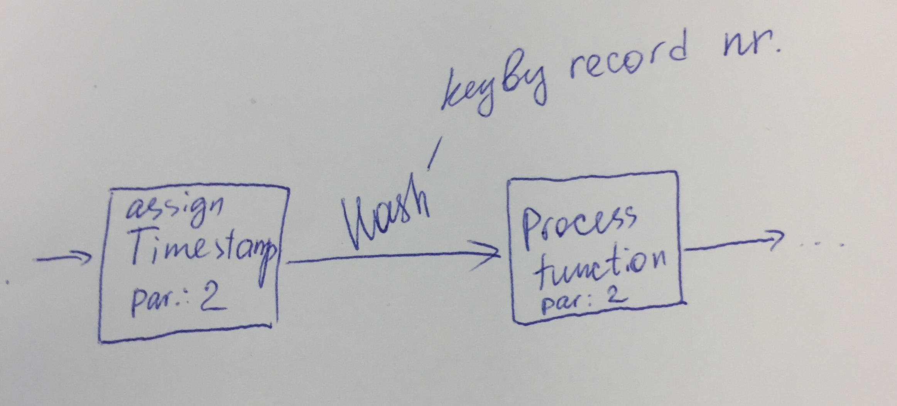
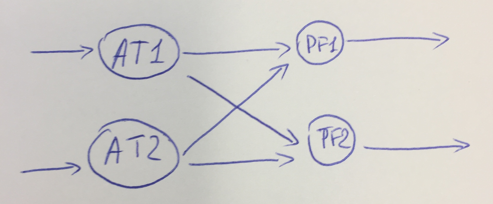
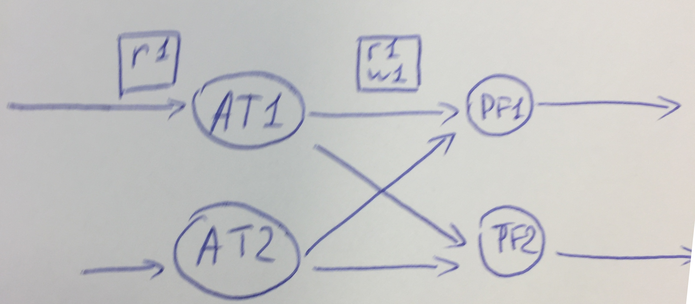
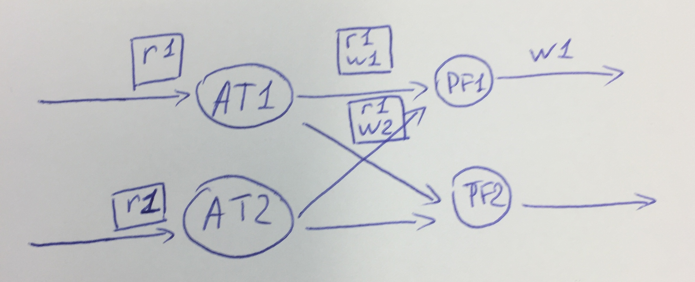
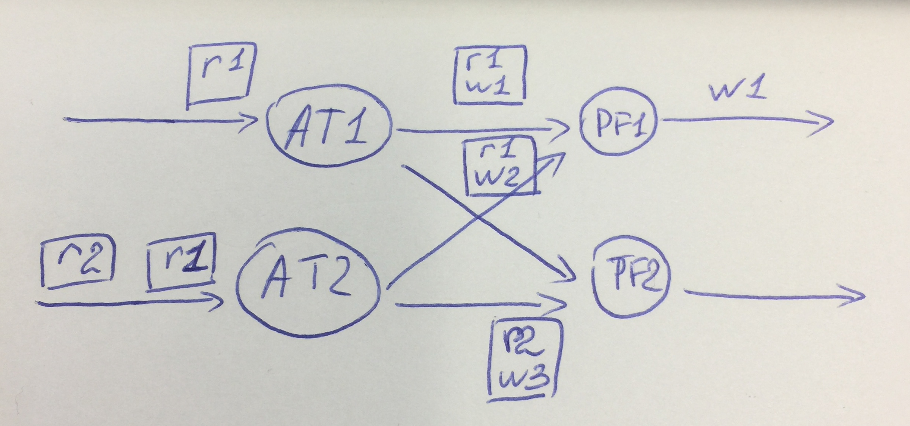

Have a look at this explanation about watermarks in parallel keyed streams: https://github.com/zcox/flink-repartition-watermark-example

We have a job with a repartition and a process function.

  
Let’s say we have parallelism of the job = 2
so the execution plan would look something like that:

1. When a record with key r1 comes in task node 1, it is assigned a watermark w1 and sent to PF1 (because that task slot is responsible for processing records with key r1). 
The record, together with the watermark is sent only to PF1.

 
2. When a record with key r1 comes in task node 2, it is assigned a watermark w2 and sent to PF1 also. 
PF1 have now received a watermark from both parts of the parallel stream, and can produce/process watermark w1 as the minimum of two. 
 

3. When a record with key r2 comes in, it is assigned a watermark w3 and sent to PF2 (because that task slot is responsible for processing records with key r2). 

 
If there are no more events with key r2, no more watermarks will reach PF2, thus we will never get a timer event there. 

**Is this the way Flink behaves when you have a keyby, or do we understand it wrong?**

Probably this is not an issue if you have enough data with different keys, evenly distributed between two task slots after keyby.
But what if we have parallelism of 100? Do the task slots after keyby need to wait for the other 99 parallel streams before producing a minimum watermark? 

Furthermore, this would produce a different result depending on the parallelism of the job, and I find it hard to believe that this is the desired behavior. 

